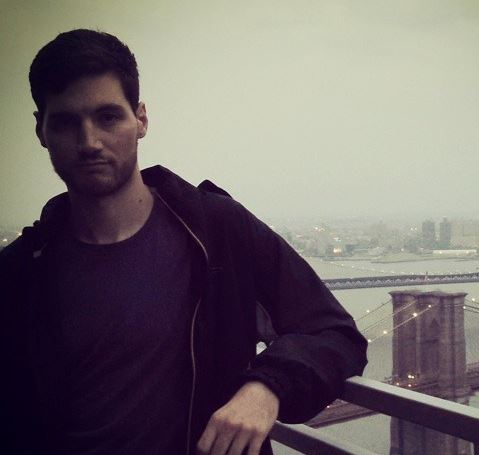

My name is Daniel Daugherty. This is my story.

I graduated from Binghamton University with a useless BA in Linguistics. Soon afterward, while job-hunting, a relative of mine told me to take the CS101 course on Coursera.org. I flew through it.

I started thinking about software engineering as a career path; soon afterward, I heard about the existence of several coding bootcamps in NYC from a guy on the bus. I knew this is exactly what I was looking for.

I taught myself Ruby in a summer, and got accepted into a bootcamp called Fullstack Academy of Code. At Fullstack, I learned fullstack JavaScript. That is, Node/Express, MongoDB, and jQuery/AngularJS. By the end of the bootcamp I'd built two Angular apps.

Immediately upon exiting Fullstack, a classmate and I undertook a freelance project. We architected various models, views, routes, incoporated front-end scripts... Built a website from the ground-up. But as is common for the first time doing a freelance gig, we ran into misunderstandings with the client. The client starting requesting features we'd never heard about before, and my partner and I decided that it would be best that we scrapped the job.

So, I turned to the job hunt. But I was met with a great deal of uncertainty. Would I be able to perform in a startup environment? How much training/time would I need before I could contribute code to production?

Then I met Phil. Phil is the digital director at Alldayeveryday, a creative agency in Manhattan. He offered me an internship, and I took it. Having never worked with Rails prior to this, I started contributing to production code within about two weeks.

I was pretty pumped.

